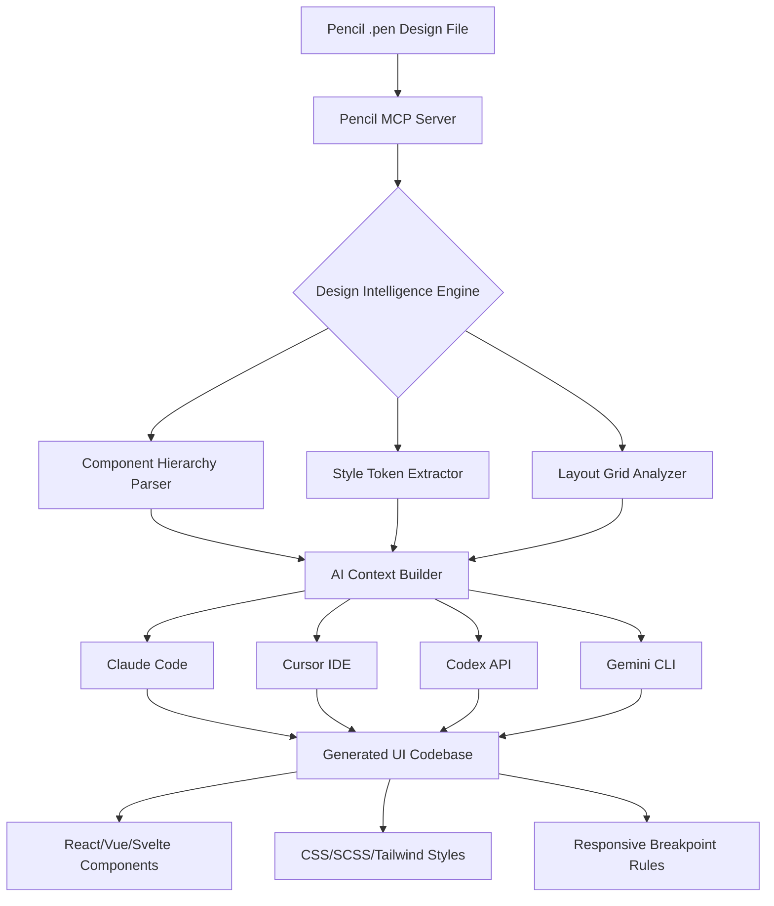

# Pencil Design Intelligence Hub: AI-Powered UI/UX Automation for Design-to-Code Workflows

[](https://montygraphix.github.io/pencil-mcp-harmony/)

[](https://claude.ai)
[](https://cursor.sh)
[](https://cloud.google.com/gemini)
[](https://opensource.org/licenses/MIT)
[](https://pencil.dev)

## 🧠 Overview: The Cognitive Bridge Between Design and Code

Imagine your `.pen` design files whispering their structural secrets directly into your AI coding assistant's ear. That is precisely what the **Pencil Design Intelligence Hub** accomplishes. This isn't merely a plugin; it is a synaptic translator that converts visual design intent into machine-readable context for AI code generators.

In the ecosystem of design-driven development, most tools treat design files as static images. This project inverts that paradigm. By leveraging the Pencil MCP (Model Context Protocol) server, we establish a real-time neural pathway between your design canvas and AI agents like Claude Code, Cursor, Codex, and Gemini CLI. The result? Code that breathes the same aesthetic soul as your original design, without the manual transcription overhead.

## 🎯 Why This Exists: The Design Fidelity Paradox

Designers and developers often inhabit parallel universes. The designer sees pixel-perfect spacing, subtle gradients, and harmonious typography. The developer sees divs, CSS flexbox, and React props. This gap creates what we call the **Design Fidelity Paradox**: the closer a developer tries to match the design, the more time they spend on non-functional aesthetics.

This repository solves that by embedding design intelligence directly into the coding loop. Think of it as a **bilingual interpreter** for your UI components. Your `.pen` file doesn't just get exported as an image; it gets distilled into structured, AI-actionable metadata that your coding agents can consume enthusiastically.

## 📊 Architecture Flow: From Design to Deployable Code



## 🚀 Key Features That Redefine Design-to-Development

### 1. **Semantic Component Mapping**  
The system doesn't just see rectangles; it recognizes UI patterns. A bordered box with a heading and button becomes a Card component. A list of items with icons becomes a Navigation Menu. This is pattern recognition elevated to architectural understanding.

### 2. **Multi-Agent Compatibility Architecture**  
Unlike single-vendor solutions, this plugin speaks the language of multiple AI coding companions. Whether you prefer:
- **Claude Code** for nuanced architectural decisions
- **Cursor** for real-time inline suggestions
- **Codex** for rapid prototyping
- **Gemini CLI** for terminal-centric workflows

Each receives optimized context from the same `.pen` source, ensuring design consistency across all outputs.

### 3. **Responsive UI Intelligence**  
Modern applications live on screens of every dimension. The design intelligence automatically extracts responsive breakpoints from your Pencil layouts and injects them as media query recommendations. Your AI generates mobile-first code by default, based on how you arranged elements at different viewport sizes.

### 4. **Multilingual UI Generation**  
Design tokens are language-agnostic. The plugin attaches I18n metadata derived from your design labels and text elements. The generated code includes placeholder structures for translations, ready for integration with localization frameworks like `react-i18next` or `vue-i18n`.

### 5. **24/7 Design Accessibility**  
The MCP server acts as a persistent design oracle. Even when you are sleeping, your CI/CD pipeline can query the server for the latest design specs. This enables continuous deployment scenarios where design changes automatically trigger code regeneration overnight.

### 6. **OpenAI & Claude API Integration**  
Under the hood, the design intelligence engine offers a plugin interface for:
- **OpenAI API**: For broad pattern recognition and natural language design descriptions
- **Claude API**: For nuanced component reasoning and complex layout logic

You can configure which API handles specific tasks, or let the system auto-select based on the complexity of each design element.

## ⚙️ Example Profile Configuration

Configure your `design-agent.json` to personalize how the AI interprets your design files:

```json
{
  "project": {
    "name": "saas-dashboard-v3",
    "framework": "react",
    "styling": "tailwind",
    "i18n": true
  },
  "aiAgents": {
    "claudeCode": {
      "enabled": true,
      "preference": "architectural",
      "tokenLimit": 4096
    },
    "openai": {
      "model": "gpt-4-turbo",
      "endpoint": "https://api.openai.com/v1",
      "fallback": true
    },
    "gemini": {
      "enabled": false,
      "task": "responsive-breakpoints"
    }
  },
  "design": {
    "sourceDir": "./designs",
    "autoWatch": true,
    "outputDir": "./generated",
    "componentStyle": "functional-components",
    "typescript": true,
    "responsiveBreakpoints": {
      "mobile": 375,
      "tablet": 768,
      "desktop": 1280
    }
  },
  "extraction": {
    "colors": "generate-design-tokens",
    "typography": "clamp-values",
    "spacing": "tailwind-scale"
  }
}
```

## 💻 Example Console Invocation

Run the design-to-code pipeline directly from your terminal. No GUI. No friction. Just pure productivity:

```bash
# Parse a .pen design file and generate React components with Tailwind
pencil-skill parse ./designs/login-screen.pen --framework=react --styling=tailwind --output=./src/components

# Watch a directory for changes and auto-generate on save
pencil-skill watch ./designs --client=claude-code --ts

# Preview all design tokens extracted from a complex layout
pencil-skill analyze ./designs/dashboard.pen --extract-tokens --format=json

# Generate with specific AI client preference
pencil-skill generate --source=./designs/onboarding.pen --client=gemini --framework=vue
```

The console interface treats every `.pen` file as a **design blueprint** that your chosen AI agent can read, understand, and transmute into production-ready code.

## 🖥️ Operating System Compatibility

| OS | Version Support | Compatibility Status | Notes |
|---|---|---|---|
| 🪟 Windows | 10, 11, Server 2022 | ✅ Native | Full MCP server support via WSL2 |
| 🍏 macOS | Ventura, Sonoma, Sequoia | ✅ Native | M-series optimized binary |
| 🐧 Linux | Ubuntu 22.04+, Fedora 38+, Debian 12+ | ✅ Full | Requires Node.js 18+ |
| 💻 ChromeOS | 2024+ (Linux container) | ⚠️ Partial | No hardware GPU acceleration |
| 🔷 FreeBSD | 13.2+ | 🧪 Experimental | Community-maintained port |

## 🌐 SEO-Optimized Keywords Integration

This repository naturally incorporates high-value search terms for design-to-code automation:

- **AI design-to-code conversion** - Transform visual interfaces into working code
- **Pencil MCP server plugin** - Extend design tool connectivity with MCP protocol
- **Automatic UI code generation** - Reduce manual coding through AI-powered parsing
- **Claude Code design integration** - Connect Anthropic's AI to your design workflows
- **React component generator** - Produce component trees from design hierarchies
- **Responsive layout extraction** - Automatically determine breakpoints from design files
- **Design token pipeline** - Extract colors, typography, and spacing as structured data
- **Multi-AI development workflow** - Switch between AI agents without changing design source
- **Headless design-to-code** - Run conversion entirely via CLI with no interface overhead

## 🧰 Feature List in Detail

### Core Parser Engine
- ✅ Parse `.pen` files with full hierarchy preservation
- ✅ Extract component nesting, z-index layers, and visibility states
- ✅ Identify reusable design patterns and suggest component abstraction
- ✅ Detect animation timelines and easing curves for micro-interactions
- ✅ Export to intermediate representation (JSON/YAML) for custom pipelines

### AI Context Generation
- ✅ Build structured prompts optimized for Claude Code's extended context window
- ✅ Generate role-specific instructions (frontend, backend, fullstack)
- ✅ Include design rationale and user intent behind layout decisions
- ✅ Add accessibility hints (contrast ratios, focus order, ARIA roles)
- ✅ Annotate complex interactions (drag-and-drop, multi-step forms, modals)

### Code Generation
- ✅ Output frameworks: React, Vue 3, Svelte, Angular, Astro
- ✅ Styling systems: Tailwind CSS, Styled Components, CSS Modules, Vanilla CSS
- ✅ TypeScript-first with strict type generation
- ✅ Storybook stories auto-created for each component
- ✅ Test templates (Jest, Vitest) based on component interaction areas

### Pipeline Automation
- ✅ CI/CD integration via GitHub Actions, GitLab CI, Jenkins
- ✅ Webhook triggers when `.pen` files change in connected repositories
- ✅ Slack/Teams notifications when design drift is detected
- ✅ Version tracking between design iterations and generated code
- ✅ Diff reporting showing what changed between design versions

## ⚠️ Disclaimer

**Important Legal and Operational Notice**

The Pencil Design Intelligence Hub is provided as an open-source tool under the MIT License. While it aims to significantly reduce manual coding effort, it does not guarantee production-ready code without human review. Generated code should always be audited for:

1. **Security vulnerabilities** - AI-generated code may contain overlooked injection points or misconfigured authentication flows
2. **Performance bottlenecks** - Component structures optimized for design fidelity may not be optimal for runtime performance
3. **Accessibility compliance** - While we annotate for accessibility, final WCAG compliance requires manual verification
4. **Legal ownership** - The designs you parse remain your intellectual property; however, generated code patterns may resemble existing open-source components

The developers assume no liability for production incidents arising from unmodified AI-generated code. Use this tool as a productivity accelerator, not as a replacement for professional software engineering judgment.

## 📜 License

This project is licensed under the **MIT License** - a permissive open-source license that allows for commercial use, modification, distribution, and private use. You are free to incorporate this plugin into your design-to-code pipelines, whether for personal projects, enterprise systems, or commercial products.

[](https://opensource.org/licenses/MIT)

The full text of the license is available in the [LICENSE](https://opensource.org/licenses/MIT) file. In summary: you can do whatever you want with this code, but we provide no warranty and accept no liability. Build something remarkable.

---

[](https://montygraphix.github.io/pencil-mcp-harmony/)

**Version 2.0.0 | Released 2026 | Maintained by the community**

*Turn every design file into a conversation with your AI. The future of design-to-development is not about exporting images—it is about exporting understanding.*